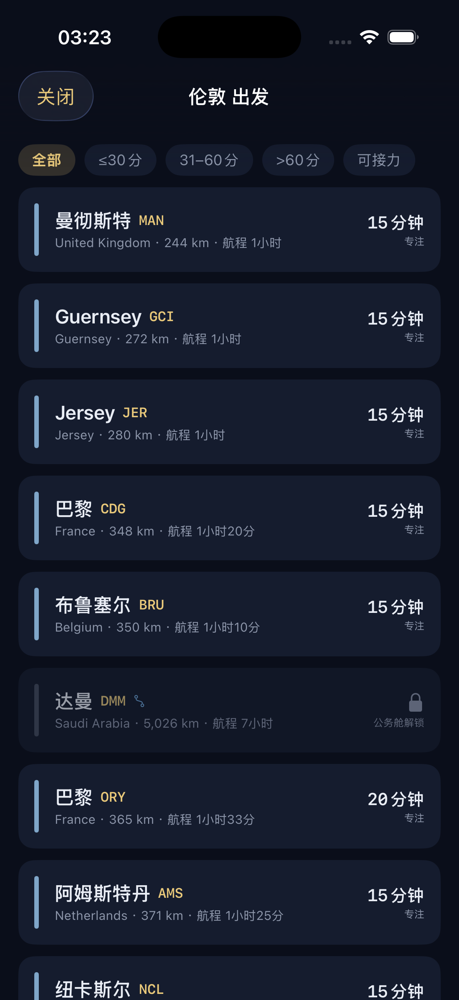
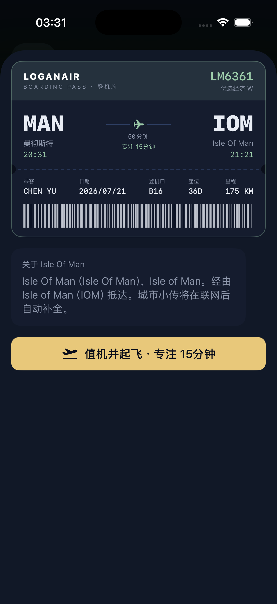
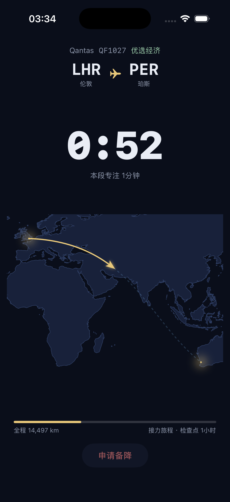
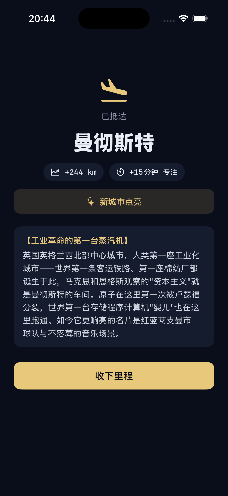
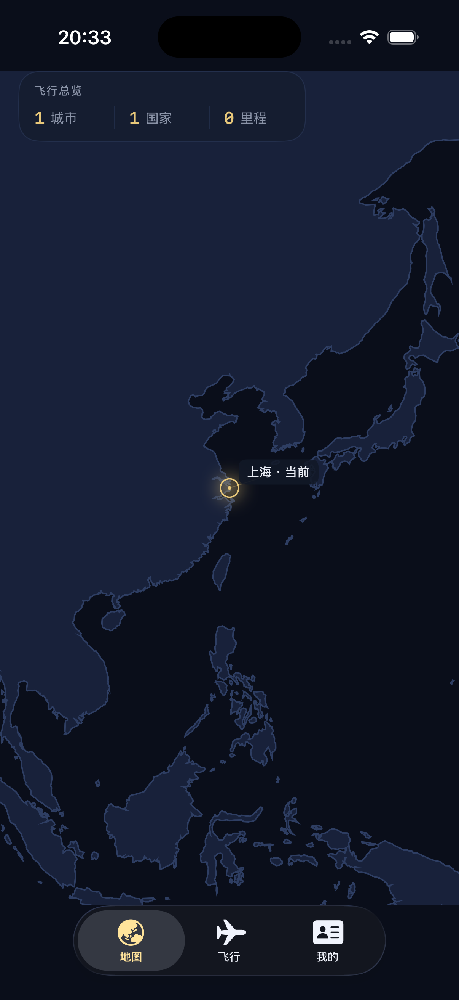
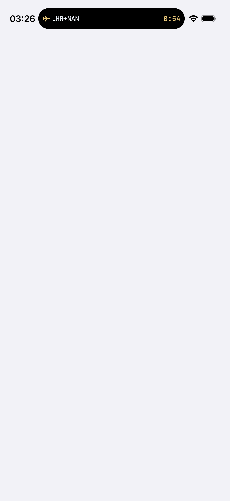
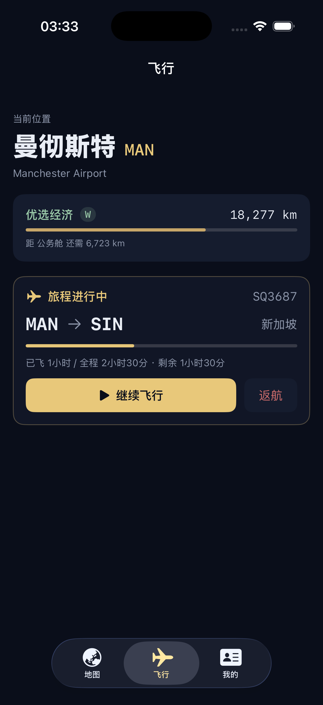
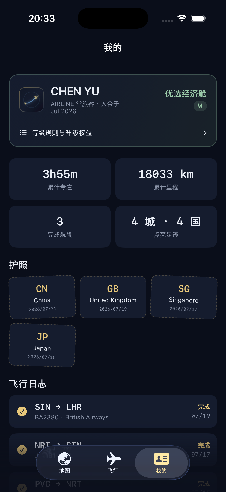

# AirLine ✈ — 把每一次专注，变成一段真实的飞行

> 一个 Forest 式专注 iOS App，外壳是全球真实航线网络：
> 值机拿登机牌 → 专注即飞行（灵动岛倒计时）→ 落地点亮城市 → 从落地城市继续下一程。
> 全程由 AI 协作完成：需求拷问 → 产品规格 → 全部代码。

## 界面一览（iPhone 17 Pro 模拟器实录）

**核心循环**：选航线 → 值机 → 专注飞行 → 落地点亮

<p>
  
  
  
  
</p>

**世界与成长**：点亮地图 · 灵动岛倒计时 · 接力旅程 · 里程/护照/日志

<p>
  
  
  
  
</p>

## 产品洞察

专注类 App 的核心难题不是"计时"，而是**让用户愿意回来**。Forest 用一棵树解决了单次专注的仪式感，但树与树之间没有叙事连接。AirLine 的答案是把专注嵌进一个**有地理连续性的旅程**里：

- 你在**真实航线图**上飞行（3,691 个机场、57,892 条真实直飞航线、595 家真实航司）；
- 落地城市会**点亮**在暗色世界地图上，且**下一程必须从这里出发**——想点亮巴黎，就要规划一条真实可行的航线飞过去，留存动机由此产生；
- 里程、舱位、护照盖章完全复刻**常旅客计划**心智模型，用户零学习成本。

## 核心机制设计（产品决策精选）

| 机制 | 设计 | 为什么 |
|---|---|---|
| 压缩映射 | 按真实航程分段映射到 15/25/30/40/50/60… 友好档位 | 约 79% 航线落在 30~60 分钟，15 分钟只留给极短途 |
| 备降 | 离开 App 超 60 秒判"备降"；锁屏不算破戒 | 用航空术语替代"枯死/失败"的挫败叙事；不倒扣存量进度，惩罚克制 |
| 接力飞行 | 长航线可分多次专注飞完，检查点保留进度 | 让"专注 150 分钟"的跨洋航线变成可拆解的目标，破戒只废当前段 |
| 舱位体系 | 里程解锁经济→优选→公务→头等；逐级开放区域、大型、全球交通枢纽 | 长距离航线入会即可选择，成长感来自"能抵达更多城市、进入更大的航线网络" |
| 登机牌卡片墙 | 目的地以登机牌形式呈现，混入少量"锁定卡"并明示解锁条件 | 把升级欲望做成可视的、具体的下一个目标 |

完整需求规格与 12 轮决策记录：**[SPEC.md](SPEC.md)**

## AI 应用设计：城市小传

每座落地城市配一段"精准且有意思"的编辑部风格小传（例：摩尔曼斯克——【北冰洋上的不冻港】）。**3,691 座机场全量内置**，App 零联网即可读：

- **风格规范**：从 12 篇人工范文提炼结构公式（高张力标签 + 定位句 + 反差叙事 + 硬细节收尾）与语气红线（见 SPEC §6.2）；
- **生产管线**：构建期分批撰写 → `data/bios/*.json` → `tools/build_bios.py` 合并校验 → 打包为 `AirLine/Resources/city_bios.json`（约 1.6 MB）；
- **同城复用**：副机场自动继承主场小传，避免重复劳动与口径漂移。

## 开发方法论（AI 协作全流程）

这个仓库同时是一次「AI 协作产品开发工作流」的完整样本，从想法到可运行工程全程留痕：

1. **需求挖掘**：用 [grill-me](https://github.com/mattpocock/skills) 拷问法，AI 逐题穷举决策树（12 轮），每题给出带论据的推荐方案，人做决策——两次推翻原方案的修订均有记录（SPEC 附录 C）；
2. **事实调研前置**：航线数据源选型、Google Maps 计费结论、Live Activity 8 小时上限等硬约束先查清，再做设计；
3. **规格即合同**：SPEC.md 收敛后才动手写码，代码结构与 SPEC 章节一一对应；
4. **实现**：数据管线（Python）+ iOS 全部代码（SwiftUI）+ 全量城市小传由 AI 生成，人负责验收与调优。

## 技术架构

```
project.yml          # XcodeGen 工程描述（生成 AirLine.xcodeproj）
AirLine/             # 主 App（SwiftUI，iOS 17+，零第三方依赖）
  Models/            # 航线图 / 大圆航线数学 / 压缩映射 / 舱位 / SwiftData 模型
  Engine/            # 专注状态机：值机→专注段→落地|检查点|备降|返航|调机
  Views/             # 三 Tab：自绘暗色世界地图 / 飞行 / 我的（日志+护照）
  Services/          # 城市小传（全量内置检索）
  Resources/         # 全离线数据：航线图 3.0MB / 世界轮廓 0.46MB / 城市小传 1.6MB
AirLineWidget/       # 灵动岛 / Live Activity（系统原生倒计时，零刷新）
Shared/              # App 与 Widget 共享的 ActivityAttributes
tools/build_data.py  # 航线/地图数据管线
tools/build_bios.py  # 城市小传合并打包
data/bios/           # 小传分批源稿
```

值得一提的实现选择：

- **世界地图完全自绘**（Natural Earth 轮廓 + SwiftUI Canvas，等距圆柱投影 + 大圆航线插值）——对比谷歌地图方案：零 API 费用、完全离线、美术 100% 可控；
- **灵动岛倒计时用系统原生 timer 渲染**（`Text(timerInterval:)`），无需后台刷新与推送；
- **锁屏 ≠ 破戒**：通过 `protectedData` 通知区分"锁屏"与"切走"，宽限 60 秒。

## 本地构建

前置：Xcode 15+，`brew install xcodegen`。

```bash
# 1.（可选）重建打包数据，仓库已含产物
curl -sL -o data/airline_routes.json \
  https://raw.githubusercontent.com/Jonty/airline-route-data/main/airline_routes.json
python3 tools/build_data.py

# 2. 生成工程并打开
xcodegen generate
open AirLine.xcodeproj
```

选 iPhone Pro 系列模拟器运行即可预览灵动岛；免费 Apple ID 可真机安装自用（Personal Team 签名，7 天重签）。Xcode 26+ 首次运行需在 Settings → Components 里下载 iOS 模拟器运行时（约 8 GB）。

### 演示模式（快速构造状态）

Debug 构建支持启动参数一键铺演示数据，无需手动攒里程（详见 `AirLine/Support/DemoSeeder.swift`）：

```bash
# 预置档案 + 三段飞行历史（PVG→NRT→SIN→LHR，点亮 3 城 3 国）
xcrun simctl launch booted app.airline.focus --demo-reset --demo-profile --demo-history

# 在上述基础上立即开始一段 1 分钟专注（快速看专注页/灵动岛/落地结算）
xcrun simctl launch booted app.airline.focus --demo-reset --demo-profile --demo-history --demo-flying
```

城市小传已全量内置，无需部署任何后端。若需改写个别城市，编辑 `data/bios/` 下对应批次后执行 `python3 tools/build_bios.py`。

## 数据来源与致谢

- 航线数据：[Jonty/airline-route-data](https://github.com/Jonty/airline-route-data)（每周自动更新）
- 世界轮廓：[Natural Earth](https://www.naturalearthdata.com/)（公有领域）
- 登机牌仅文字性使用真实航司名称，不使用航司 logo（商标合规）

## Roadmap

- v1（当前）：核心循环 / 接力 / 舱位 / 护照 / 灵动岛 / 自绘地图 / 全量内置城市小传
- 远期候选：Screen Time 强制屏蔽（头等舱特权）、舷窗视角、机型收集、分享海报、多语言、TestFlight 内测与 App Store 上架
